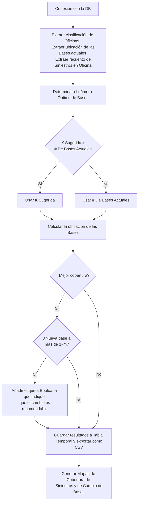

## **Descripción**
De manera general, este proyecto tiene como objetivo mejorar la colocación y distribución de bases de ajuste de HDI a nivel nacional, buscando optimizar la cobertura y tiempos de respuesta de acuerdo con los patrones de ocurrencia de siniestros. Para ello, se revisará la implementación actual, llevando a cabo análisis exploratorios para detectar patrones de siniestralidad y buscaremos, si es viable, formular el problema como uno de optimización en lugar de un problema de agrupamiento. De esta forma, se espera maximizar la eficiencia de las bases de ajuste y lograr que su ubicación se adapte dinámicamente a cambios en la demanda y ubicación de siniestros, garantizando una mejor cobertura y tiempos de respuesta a lo largo del tiempo.

### **Objetivos**

1. **Evaluación de la Implementación Actual**  
    Realizar un análisis exhaustivo de la colocación y cobertura de las instalaciones actuales, identificando limitaciones y posibles áreas de mejora en la metodología actual de ubicación.
    
2. **Análisis Exploratorio de Datos para Identificar Tendencias**  
    Examinar los datos históricos de siniestralidad para determinar si existen tendencias temporales o patrones geográficos de siniestros que puedan justificar la reubicación o ajuste periódico de instalaciones.
    
3. **Automatización de la Designación de Instalaciones (Bases de Ajuste)**  
    Desarrollar y automatizar un sistema para designar la ubicación de las “bases de ajuste” usando ventanas de tiempo móviles, permitiendo capturar cambios en la siniestralidad y ajustar la ubicación de instalaciones cuando estas se desvíen de los patrones actuales.
    
4. **Evaluación del Problema como Optimización**  
    Reformular el problema de colocación de instalaciones como un problema de optimización, para maximizar la cobertura, mejorar los tiempos de respuesta y optimizar los recursos en función de la ubicación de siniestros.
    
5. **Experimentación y Validación de Métodos**  
    Comparar los resultados del enfoque de optimización propuesto con los métodos actuales, midiendo el desempeño a través de métricas clave de cobertura y tiempos de respuesta, e identificar el mejor enfoque para su implementación.

## **Hoja de Ruta**

| **Fase**                                                     | **Tareas**                                                                                                         | **Inicio Estimado** | Fin Estimado | Estado                                             |
| :----------------------------------------------------------- | :----------------------------------------------------------------------------------------------------------------- | :------------------ | :----------- | -------------------------------------------------- |
| **Fase 1: Análisis del Proyecto Existente**                  | Revisar la implementación actual.                                                                                  | 21/10/2024          | 25/10/2024   | Completado    |
|                                                              | Evaluar posibles limitaciones y áreas de mejora en la metodología actual.                                          | 21/10/2024          | 25/10/2024   | Completado    |
| **Fase 2: Análisis Exploratorio de Datos (EDA)**             | Realizar un Análisis Exploratorio de Datos para explorar la viabilidad de re-evaluar las bases de ajuste actuales. | 24/10/2024          | 01/11/2024   | Completado    |
|                                                              | Identificar cambios en los patrones o tendencias de ocurrencia de siniestros a lo largo del tiempo.                | 24/10/2024          | 01/11/2024   | Completado    |
| **Fase 3: Automatización de la Asignación de Instalaciones** | Definir criterios de ajuste en la ubicación de instalaciones cuando se encuentren desviadas por cierta distancia.  | 29/10/2024          | 01/11/2024   | Completado    |
|                                                              | Automatizar la obtención de la ubicación de las bases de ajuste.                                                   | 29/10/2024          | 08/11/2024   | Completado    |
|                                                              | Evaluar ventanas de tiempo móviles para capturar cambios en las tendencias de siniestralidad.                      | 04/11/2024          | 08/11/2024   | Completado    |
| **Fase 4: Re-evaluación del Problema como Optimización**     | Analizar la posibilidad de reformular el problema actual como un problema de optimización.                         | 11/11/2024          | 22/11/2024   | En Progreso   |
|                                                              | Calcular métricas de cobertura, tiempos de respuesta y otros KPIs clave para determinar la viabilidad del enfoque. | 11/11/2024          | 22/11/2024   | En Progreso   |
|                                                              | Incorporar una API de rutas geográficas para determinar las bases de ajuste por distancia y tiempo en ruta.        | 25/11/2024          | 29/11/2024   | Por Comenzar |
| **Fase 5: Experimentación y Validación de Enfoques**         | Realizar experimentación para determinar el mejor enfoque de optimización.                                         | 02/12/2024          | 15/12/2024   | Por Comenzar |
|                                                              | Comparar KPIs con datos históricos e incorporar la re-evaluación con ventanas de tiempo móviles.                   | 02/12/2024          | 15/12/2024   | Por Comenzar |

## **Estructura del Pipeline**

